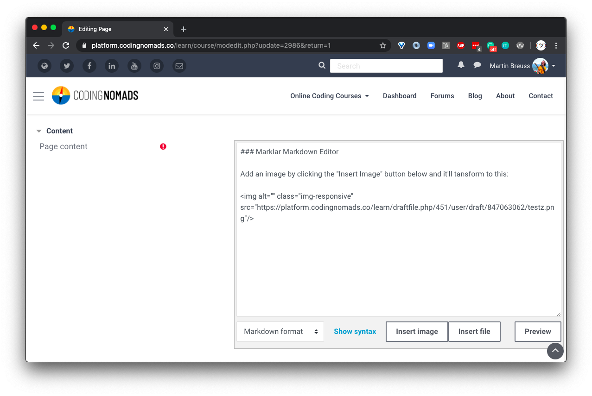

# Markdown Course Creation

We advise to use **Markdown** for writing your course content. It is simple to read and write, introduces consistency through limiting options, and makes the content easy to re-use in other contexts. Write in Markdown rather than using a text editing program such as MS Word or Google Docs.

It is also better to use Markdown than directly creating your content inside our learning platform. The latter can sometimes be a drag due to the content box window sizing and other platform-related small annoyances. It might also make the content too site-specific and difficult to transition elsewhere. We've made this mistake before, and would prefer to avoid accruing more technical debt.

**Note:** If you still want to use the **platform-included WYSIWYG editor** (called "Atto"), please check out [how to choose your text editor](02-markdown-course-creation.md#text-editor-choice) and make sure to thoroughly read over and **stick with our [Style Guide](11-platform-style.md)**.

Here is a screencast that explains how to add your Markdown content to a resource in our platform:

<iframe width="560" height="315" src="https://www.youtube.com/embed/fNW_77QC67E" frameborder="0" allow="accelerometer; autoplay; encrypted-media; gyroscope; picture-in-picture" allowfullscreen></iframe>

## Headings

As a small deviation from keeping your content as platform-agnostic as possible, you should use lower-level headings as your page's main headings:

- **Main Headings:** Use `<h3>` (or `###` in Markdown) as your page content's main heading.
- **Sub-Headings:** Use `<h4>` (or `####` in Markdown) as your page content's sub-headings.

The course content will be integrated in our platform, and higher-level headings are reserved for course and page headings, which need to be entered in a different entry form.

## Links

We want to make sure that all links open up in a new tab when clicked, to avoid students from accidentally navigating away from the course. Markdown syntax doesn't have an equivalent to HTML's `target="_blank"` which would allow to open links in new tabs. Therefore, please use real HTML for creating links in your Markdown docs:

```html
This is <a href="http://your.url" target="_blank">a link</a>
```

**Auto-Expand Text Snippets**

To avoid having to type this out for every link, you can use **Code Snippets** functionality on your text editor. E.g. if you are using **VSCode** you can use the following for your _Code -> Preferences -> User Snippets -> `markdown.json`_:

```json
{
	"Create New Tab Link": {
		"prefix": ["tab", "tab-link", "tl"],
		"body": ["<a href='${1:https://}' target='_blank'>${2:description}</a>"],
		"description": "HTML link base that opens link in a new tab."
	},
	"Create Markdown Image Link For Docs": {
		"prefix": ["im", "img-int", "ii"],
		"body": [""],
		"description": "Docs internal Markdown image link."
	},
	"Create Alert Box": {
		"prefix": ["ab", "alert-note", "note"],
		"body": ["<div class='alert alert-warning' role='alert'>",
				 "    <strong>Note:</strong> ${1}",
	  			 "</div>"],
		"description": "Create Bootstrap alert-warning Note box."
	},
	"Create Info Box": {
		"prefix": ["ib", "alert-info", "info"],
		"body": ["<div class='alert alert-info' role='alert'>",
				 "    <strong>Info:</strong> ${1}",
	  			 "</div>"],
		"description": "Create Bootstrap alert-info Info box."
	},
	"Create kbd": {
		"prefix": ["kbd"],
		"body": ["<kbd>${1}</kbd>"],
		"description": "Create an HTML 'input' tag."
	}
}
```

Alternatively, you can also us your operating systems' Keyboard Text Replace functionality. If you're on MacOS it looks like this:


Same as with the code snippets in your text editor, this setting allows you to type e.g. `tl` in your browser where you are editing your Markdown, and it will auto-expand to `<a href="" target="_blank"></a>`. Then you only need to paste the URL and the link text.

Code Snippets have the advantage that you can define where your cursor is placed and generally offer more possibilities to fine-tune the snippets. If you can, use your text editor's snippet functionality.

**Script-Replace All Your Markdown Links**

You can also use [this script](https://github.com/CodingNomads/utils#replace_linkspy) to replace all normal Markdown links with HTML links that open up in new tabs. If you make sure to remember to use this script before publishing, you can write Markdown links as you're used to. Before uploading your content to our platform, you then only need to run the script. This may be useful if you already have content written that uses normal Markdown links and can save you some editing time.

## Code And Code Blocks

Code snippets wrapped in single backticks as well as code blocks with triple-backticks are correctly rendered by the platform's Markdown engine.

## Example Markdown Rendering

When entering your content in Markdown, it will look like that during input:


The above Markdown text will correctly render in our platform like so:


## Text Editor Choice

You can change your default text editor in your user profile's cogwheel drop-down `Editor Preferences`. Choose `Marklar` for the easiest Markdown editing functionality.

The **Marklar** editor allows you to:

* **write** your content in Markdown
* **preview** with a simple button click
* **add images** through a straightforward file upload

The video below shows how to change your text editor preferences. Follow the instructions, but instead of selecting the "Plain Text Editor", choose the new **"Marklar"** editor option. The rest of the process is the same. After you selected the correct editor, your page editing should like like this:



<iframe width="560" height="315" src="https://www.youtube.com/embed/GeHyN-TZ5JY" frameborder="0" allow="accelerometer; autoplay; encrypted-media; gyroscope; picture-in-picture" allowfullscreen></iframe>