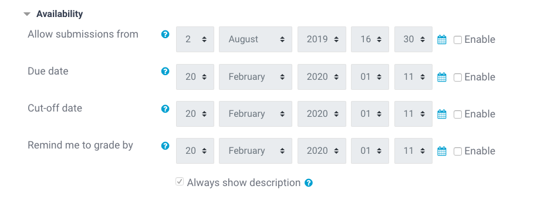

# Assignment Resources

This section contains information about setting up **Assignment** resources on our platform. Generally it will be easier for you if you _clone_ one of the existing Assignment resources that come with your skeleton course.

## Objective

Assignment resources are meant as checkpoints for students, where they know they need to complete something and submit it in order to finish the task. These resources are currently not optimal, since they were built for other types of assignments than the ones we are asking our students to complete. They still work well as _checkpoints_ where students can post e.g. a GitHub link to their finished assignment, and are later able to quickly find it and discuss their code with their mentor.

## Creating Assignments

If you really need to create an Assignment resource yourself, make sure to adapt the following sections in the Assignment resource's settings:

Set the `Grade` to `None`. Assignments are meant to be completed and submitted, but we are currently not grading them through the platform's system:

Make sure that all boxes called `Enable` in the `Availability` section are **unchecked**. We _don't_ want to restrict submissions to a certain date range, since we are not working with time-dedicated student cohorts:

## Completion Settings

This should be automatically set so that the resource has the condition that students _submit_ it. If for any reason this is not the case, please make sure that the [Course Completion Settings](03-course-completion.md#course-completion) are set accordingly.