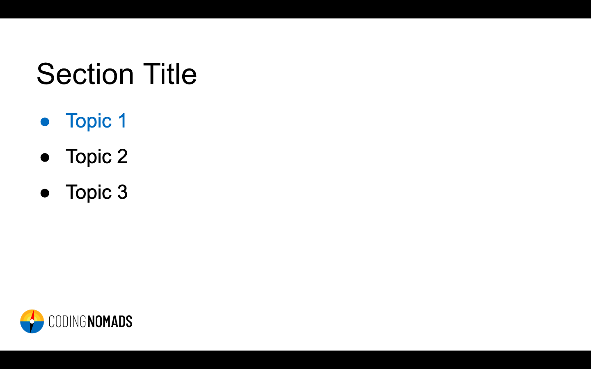

# Creating Videos

This document will guide you in how to create video lessons for your course. Let's start with a tl;dr (but _do_ read over it):

* **Hardware:** A good mic is extremely important, also use a pop filter and a mic arm
* **Software:** If possible, use screen recording software
* **Screen Resolution:** 16:9
* **Video Length:** 3-5 minutes is best, definitely stay below 10 minutes
* **Tone:** Your friendly neighborhood coder

## Didactic Structure

Same as with your written content: follow the **3-step-teaching principle**:

* **Intro**: Tell your students what information you will give them
* **Main**: Give them that info
* **Recap**: Tell them what information they just got

## Screencast Recording Tips

* [Recording Screencasts - Hardware, Software, Dos and Don'ts (by Wes Bos)](https://syntax.fm/show/037/recording-screencasts-hardware-software-dos-and-don-ts)
* [Code School Screencasting Framework](https://gist.github.com/olivierlacan/4062929)
* [How To Record a Programming Screencast (by Scott Lilly)](https://scottlilly.com/how-to-record-a-programming-screencast/)
* [How To Create Screencasts That Don’t Suck (by Shawn Hesketh)](https://shawnhesketh.com/create-screencasts/)

## Examples Of Coding Screencasts

* [Beginner's Guide to JavaScript (by Guil Hernandez)](https://www.youtube.com/watch?v=UOeofWla8mE)
    - Highly legible coding examples even at small screen sizes, editor is full screen.
* [What's the meaning of underscores (_ & __) in Python variable names? (by Dan Bader)](https://www.youtube.com/watch?v=ALZmCy2u0jQ)
* [Python Tutorial for Absolute Beginners #1 - What Are Variables? (by YK Suaishita)](https://www.youtube.com/watch?v=Z1Yd7upQsXY)
* [Python Tutorial for Beginners 8: Functions (by Corey Shafer)](https://www.youtube.com/watch?v=9Os0o3wzS_I)
    - **Note:** Font size could be increased
* [Heres how JavaScript "Named Params" Destructuring Works (by Wes Bos)](https://www.youtube.com/watch?v=c2PGgkCIjEA )
    - **Note:** Stopping to show your face after the intro gives more space for your code
* [Heres how React's New Context API Works (by Wes Bos)](https://www.youtube.com/watch?v=XLJN4JfniH4)
    - **Note:** Removing editor menu bars etc. avoids clutter and dating of the video
* [Free Courses at Vuemastery.com](https://www.vuemastery.com/)

---

## Hardware

Great audio quality is extremely important for quality screencasts. Having a good microphone makes up for most of that, but there are also a couple of other things to consider. Read about how to improve your hardware setup for audio recording in this section.

### Microphone

If you are serious about creating quality screencasts, a good microphone is essential. Please contact us if you are building a course but you don't have a quality microphone equipment, since we may be able to support you in purchasing one.

**Recommendation:** "Audio Technica ATR 2100 USB" (or "Samson Q2U" in Europe). This is a low-price but high-quality microphone that operates over USB. It is small and simple to handle, yet dramatically increases the audio quality as compared to your built-in computer mic.

#### Microphone Adjustments

- **Distance:** Aim for 2-20cm (1-8 inches) between your mouth and the microphone.
- **Direction:** Aim to speak directly into the mic, not off to the side.
- **Gain:** Turn up your gain, but avoid it going too high.

<iframe width="560" height="315" src="https://www.youtube.com/embed/hZe2ugX4h9A" frameborder="0" allow="accelerometer; autoplay; encrypted-media; gyroscope; picture-in-picture" allowfullscreen></iframe>

### Additional Equipment

**Mic Arm:** Sinc you will want to have your computer in front of you for coding, a mic arm can help to place the mic where you need it for a good recording outcome.

**Pop-Filter:** Plosives, such as "p", "t", "k", can come out surprisingly loud and disturbing in a spoken audio recording. A pop filter can help to reduce these pop sounds.

**Headphones:** In case that you like to hear your voice during the recording, a pair of headphones will be necessary. Use in-ear headphones to avoid any sound they produce from leaking into your recording.

**Audio Foam:** Using audio foam can reduce room echo. If you have a small room with fabric, such as a walk-in closet, that can also work as an uncomplicated alternative.

**T-Shirt:** No, this is not about getting dressed! Putting a T-Shirt under your laptop while recording can significantly reduce the clicking noise that your computer keys make.

# Software

Most of your videos will be **screen recordings**. The important part to remember is that we want you to record both your video as well as audio in the **highest resolution** that makes sense. Large files are not a problem, and having a high video and audio quality allows for more precise editing (e.g. code zooms when necessary) without compromising the viewing experience. Below is a list of software solutions that help you with recording your screen while retaining video quality as well as your personal sanity:

* **QuickTime Player** (MacOS): Comes with the OS and is a simple way to [get started](https://www.youtube.com/watch?v=fgBWvU3YNhM). **Price**: Free
* [**iShowUInstant**](https://shinywhitebox.com/ishowu-instant) (MacOS): Allows to record specific windows and even set the size of a recording screen. Easy to start/pause/stop recordings. Low-cost option that makes already improves your screen recording experience. _(I, Martin, use this one. Happy to answer questions about it)_ **Price**: $24
* [OBS Studio](https://obsproject.com/) (MacOs, Windows, Linux): Free and Open-Source software for video recording and live streaming. Check out these tutorials [for Windows](https://www.youtube.com/watch?v=QCpuTSFVohQ) or [for Linux](https://www.youtube.com/watch?v=PBmOEaRgRas) **Price**: Free
* [Screen Flow](https://www.telestream.net/screenflow/) (MacOs): Professional screen recording software with a higher price tag and more features. **Price**: $129
* [Camtasia](https://www.techsmith.com/video-editor.html) (MacOS, Windows): The biggest and baddest (but in a good way). Includes a full-featured and easy-to-use editing studio as well. Haven't used it myself, but heard good things about it. Probably overkill, though, unless you're really into that. **Price**: €269.05

**Additional Software**

* [**KeyCastr**](https://github.com/sdeken/keycastr) (MacOs): you can show key presses on screen, which helps viewers if you're using any keyboard shortcuts. The program allows you to display all key presses or only command keys, and is easy to toggle on and off.

* [**Mousepose**](https://boinx.com/mousepose/overview/) (MacOs): allows to highlight your cursor to better show clicks and cursor movements on your recording. Alternatively, you can increase your cursor size through your operating system’s accessibility settings.

# Recording

## Video Length

**3-5 minutes:** Keeping your videos short helps both you and your students to stay on track. Aim for 3-5 minutes per video, and definitely stay below 10 minutes. If you are explaining a complex concept that requires more time, split it up in logical chunks that are each below 10 minutes. Keeping our students engaged is paramount, so we want to give them the sense of achievement and completion when finishing a section as often as possible. Our brains are also much better at processing small chunks of information, and it's easier for students to go back and revisit a topic if the videos are on-point, clear, and easy to digest.

**Shorter videos:** You can also create shorter videos, e.g. to introduce a section in the course. Such videos can be only 1 minute long, yet help students to prepare for an upcoming new topic.

## Screen Resolution And Framerate

Always record in a **16:9 ratio** with a framerate of **60 FPS**. Don't go below 30 FPS since cursor movements start looking jumpy and are then difficult to follow. To assure the right screen ratio, either set your screen resolution to 16:9 and record fullscreen, or create a defined 16:9 area on your screen and record only that section. [Screen recording software](07-creating-videos.md#software) can greatly help with both aspects.

**Fullscreen-Recording**: Your screen needs to be set to a 16:9 resolution (e.g. 720p HiDPI (= 1440p real resolution), 1080p or 720p). If your computer doesn't support a 16:9 screen resolution, there are a few hacks you can attempt:

* **External Monitor**: If you have access to an external monitor with the right aspect ratio, this can be a great way to go. It also allows you to use your laptop for notes etc. while recording.
* **Hidden Display Options**: On some MacBook models and MacOS versions, you can access additional resolutions with a small "trick". In your display preferences, hold "option" when clicking on "Scaled" to see previously hidden resolutions:

* [SwitchResX](https://www.madrau.com): In case the above doesn't work for you, SwitchResX is a tool that allows setting user-defined screen resolutions on MacOS. **Price**: $14

# General Info

## Which Sections Should Have a Video?

**Every Section** should have at least one video. Screencasts offer students a different way to approach the material. They get **exposure** to a topic that is new for them, and the proof that, and how, it can be done. This makes a big difference in preparing the mind to accept new information.

>_I like it if every new concept that's introduced is shown at least once by the instructor._ (Student Quote)

Video Screencasts are our online way of walking students through a concept and giving them the high-level understanding and confidence that it can be done.

### Course Intro & Goodbye Video

Every course should have an intro video as well as a goodbye video. Make your students feel welcome and cared for. Introduce yourself as well as your course in the introduction video, and congratulate your students and point them to next steps in your goodbye video. Feel free to record yourself speaking. If you do so, remember to keep your background neutral. These videos can be very short (~1 min).

### Section Intro Videos

Optionally you can create short section introduction videos (~1 min) that audio-visually explain what topics will be addressed in the upcoming course part. For these videos, you can use Google Sheets or PowerPoint to create simple and minimal slides that address the main points the section will be talking about.

## Screencasts, Slides, Or Face Recording?

Most videos should be **screencasts**. You want to show your students how you code and solve challenges, and get them familiar and comfortable looking at a screen with code. Screencasts with voice narration are therefore the main type of videos you should create for your course.

That said, you can always loosen it up and increase retention and enjoyment for your students. You can use **slides** to introduce new topics and to create recaps at the end of a section. In the intro and goodbye videos, and also sometimes in between, if you feel comfortable with that, you can **record yourself talking** directly to your students, giving them encouragement.

### Slides

When using slides for any of your videos please use our [slides template](https://docs.google.com/presentation/d/1TDzErFmyVnDkRoyWrotm8rE3Yy-yikzUFmeV0mCD4Dk/edit?usp=sharing) and clone your slides from it. We suggest doing this in order to keep the style consistent across multiple courses.

Stick with [this basic design](https://docs.google.com/presentation/d/1TDzErFmyVnDkRoyWrotm8rE3Yy-yikzUFmeV0mCD4Dk/edit?usp=sharing). It'll help your students to focus on the essential information.

---

# tips
- when there's only coding, don't talk anything
    - helpful for editing when there is no sound
- easy to speed it up in editing
- at the end quickly explain what you did
- avoid background noise
- avoid 'ahems' etc. - it feels much more professional
- mostly use screenshares, you can also sometimes show your face if you want to
- be explicit about when there are mistakes (what time etc.) - quicker to cut them out when editing
    - undo to get back to working version
    - when realizing that explanation doesn't go too well

- title of videos (saved filename)
- add a README for notes about editing
- note when there should be a screen overlay (e.g. mis-naming when talking)

- when recording yourself, make sure your recording setup and table is stable, so that the camera doesn't move
- at a minimum, use headphones and a headphone mic
- if you have a better microphone, please use that instead

- upload the finished recordings to a google photos folder for sharing

* stable setup, avoid background noise
* to make editing easier:
    - use zoom, use pause
    - don't talk while coding lengthily if it gets you off track, then better explain when finished
    - name file with the title of the video
    - add notes in doc
        * mistake to cut and their timestamps
        * where screen overlay is needed and what should go on there