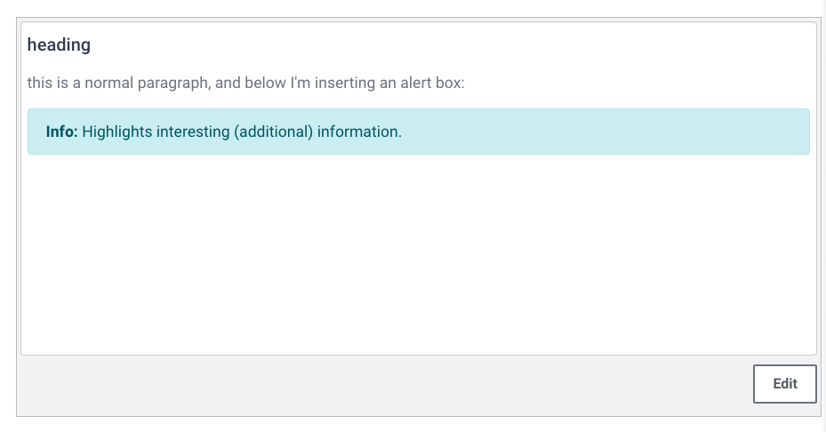
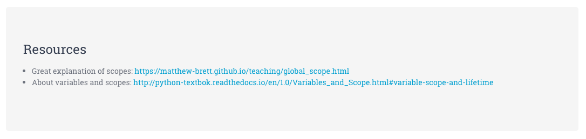

# Consistently Styled Course Content

**Note:** **Use Markdown** to create your course content. It will make most of the below information irrelevant to you. If you feel the need to style more individually, [**use Bootstrap classes**](https://getbootstrap.com/docs/4.0/getting-started/introduction/). Bootstrap is included in the theme we're using. Only if neither fulfills your creative urges, read on for more fine-grained styling.

## Objective

We want **unified and adaptable styling** across all courses on the whole site.

- **Simple**: Simple elements are favored over complex ones, because they are easier to set up and maintain
- **Reusable**: Allow Bootstrap to style your page, it's already included.
- **Maintainable**: Through consistent and simple structure, we can adapt styles centrally and avoid unnecessary effort and potential misalignment

Therefore, we ask you to use **simple HTML** (e.g. through using the Markdown editor or the WYSIWYG editor) and customize the resulting HTML only minimally, with the following custom components:

## Custom Components

Additional custom components you can use when creating and editing courses.

### Course Overview Page Additional Styling

The following adaptations should be used to make the course overview page styled consistently and easier readable for students.

#### 1. Section Dividers

To improve the visual flow in a course overview, you can add colored bars to break up the course content.


**Section Dividers:** These can be used to sub-divide a larger section and give it a relevant sub-section heading. Create a "Tag Resource" on the platform, and add the following HTML code in the HTML editor:

```html
<h5 class="section-divider">Section Mini-Heading</h5>
```

**Assignment Dividers:** To indicate to students that the following materials require their own input, we use differently-colored dividers for a section that consist of instructions for mini-projects, quizzes, etc. You can create such a divider also using the "Tag Resource" and entering the following HTML code in the HTML editor:

```html
<h5 class="section-assignment">Assignments</h5>
```


#### 2. Section Tags

Section tags in the "Summary" of each section help students stay on track and visually bundle multiple sections logically together.

<iframe width="560" height="315" src="https://www.youtube.com/embed/evwWenaThmM" frameborder="0" allow="accelerometer; autoplay; encrypted-media; gyroscope; picture-in-picture" allowfullscreen></iframe>

Switch off blue and yellow tags for better visual grouping.

Blue:

```html
<div class="d-flex flex-row-reverse">
  <span class="badge badge-pill badge-info">
      Section 1
  </span>
</div>
```

Yellow:

```html
<div class="d-flex flex-row-reverse">
  <span class="badge badge-pill badge-warning">
    Section 2
  </span>
</div>
```


---

### Page Resources Individual Styling

The following custom style elements should be considered when creating written documentation for your course content.

#### Headings

In the **visual editor**, use editor-provided headings levels:

- "Heading (large)" option creates `<h3>` element
- "Heading (medium)" option creates `<h4>` element
- "Heading (small)" option creates `<h5>` element

**Don't apply any editor styles to your headings.** We want to avoid individually bolded headings. Avoiding individual styles allows us to increase heading size, font-weight, etc. centrally through SCSS.

In **Markdown**, use the equivalent heading levels that the visual editor uses:

- Top-level heading: `###`
- Second-level heading: `####`
- Lowest-level heading: `#####`

#### Information And Alert Boxes

<iframe width="560" height="315" src="https://www.youtube.com/embed/TSSkUdmHl2I" frameborder="0" allow="accelerometer; autoplay; encrypted-media; gyroscope; picture-in-picture" allowfullscreen></iframe>



Use the Bootstrap alert box `alert alert-warning` for criticial information and gotchas. E.g.:

>"Just read over this for now, we'll dig deeper into it in a later section."

```html
<div class="alert alert-warning" role="alert">
  <strong>Note:</strong> Take care to avoid xyz.
</div>
```

Use `alert alert-info` to include additional information e.g. on external resources that can lead students further onwards. E.g.:

```html
<div class="alert alert-info" role="alert">
  <strong>Info:</strong> The first bug was a real bug!
</div>
```

The Bootstrap alert boxes also help to visually break up a long piece of content by highlighting an important section.

<iframe width="560" height="315" src="https://www.youtube.com/embed/3REbh9xr5lE" frameborder="0" allow="accelerometer; autoplay; encrypted-media; gyroscope; picture-in-picture" allowfullscreen></iframe>

**Note:** If you need to use **multiple lines** in your alert boxes, use `<br>` tags to create newlines (instead of using `<p>` tags). This results in nicer-looking alert boxes without additional spacing.

#### Code Blocks

Wrap code snippets into triple-backticks. This works both in Markdown as well as the visual editor:

    ```
    print("your code here")
    ```

**Note:** Syntax highlighting can sometimes be broken. This might be annoying and we hope to find a fix that'll solve it site-wise.


#### In-line Code

**In Markdown**, simply wrap your in-line code into [**single backticks**](https://daringfireball.net/projects/markdown/syntax#code).

**In the visual editor**, there is no button for marking a section of text as inline code. Therefore, you will need to switch to the _HTML editor_ and wrap in-line code snippets into `<code>your_code()</code>` tags.

#### Embedded Resources

For external videos that are not hosted on our vimeo account and e.g. external code playgrounds, use [Bootstraps responsive embed class](https://getbootstrap.com/docs/4.0/utilities/embed/):

```
<div class="embed-responsive embed-responsive-16by9">
  <iframe class="embed-responsive-item" src="your_embed_url" allowfullscreen></iframe>
</div>
```

#### Resources

```html
<div class="jumbotron resources">
<h1>Resources</h1>
</div>
```

Paste the above HTML snippet into the HTML editor of your resource. Next, switch back to the WYSIWYG editor view and copy-paste your resource links into the body of the jumbotron. Style them as a bullet point list. Result:



#### Quotes

To highlight a section of your documentation as a quote, please use the [Bootstrap-provided blockquote HTML](https://getbootstrap.com/docs/4.0/content/typography/#blockquotes):

```html
<blockquote class="blockquote text-right">
  <p class="mb-0">[...] programs must be written for people to read, and only incidentally for machines to execute.</p>
  <footer class="blockquote-footer">Abelson & Sussman in <a href="https://mitpress.mit.edu/sites/default/files/sicp/full-text/book/book-Z-H-7.html#%_chap_Temp_4"><cite title="Structure and Interpretation of Computer Programs">Structure and Interpretation of Computer Programs</cite></a></footer>
</blockquote>
```

We are applying some custom CSS to it to make the quotes look like shown below:


#### LaTeX

If you want to use [LaTeX](https://www.latex-project.org/) to display formulas, the Marklar Markdown editor only supports LaTeX **blocks**:

```md
$$content$$
```

E.g. in order to display the following formula correctly rendered like so:


You can write the following in the Marklar editor:

```md
$$\text{EMA}_{t}=[V_t \times (\frac d {1+n})] + \text{EMA}_y \times [1 - \frac d {1+n}]$$
```

For more information, refer to [the LaTeX docs](https://www.latex-project.org/help/documentation/).

**Note:** If you need to use a couple of single-line LaTeX in a row, e.g. for explaining the contents of a formula in more detail, we suggest to use a [Bootstrap table](https://getbootstrap.com/docs/4.0/content/tables/) for easier viewing, e.g.:

```html
<table class="table">
  <tbody>
    <tr>
      <th scope="row">1</th>
      <td>$$\text{EMA}_t=\text{EMA today}$$</td>
    </tr>
    <tr>
      <th scope="row">2</th>
      <td>$$p_t=\text{price today}$$</td>
    </tr>
    <tr>
      <th scope="row">3</th>
      <td>$$\text{EMA}_y=\text{EMA yesterday}$$</td>
    </tr>
  </tbody>
</table>
```

Renders to:

