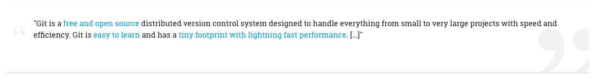

# Consistently Styled Course Content

**Note:** **Use Markdown** to create your course content. It will make most of the below information irrelevant to you. If you feel the need to style more individually, [**use Bootstrap classes**](https://getbootstrap.com/docs/4.0/getting-started/introduction/). Bootstrap comes included with the theme we're using. Only if neither fulfills your creative urges, read on for more fine-grained styling.

---

## Objective

We want **unified and adaptable styling** across all courses on the whole site.

- **Simple**: Simple elements are favored over complex ones, because they are easier to set up and maintain
- **Reusable**: Use Bootstrap, it's already included. If you _need_ to be more specific, use HTML elements with CSS classes
- **Centralized**: All custom styling should be done _only_ through the SCSS in Maker Theme
- **Maintainable**: Through editing styles centrally we can avoid unnecessary effort and potential misalignment

## Where Can I Add To The Site's CSS?

You can access the [**Maker** Theme settings](https://platform.codingnomads.co/learn/admin/settings.php?section=themesettingmaker) at the following platform-internal path:

`Site administration / Appearance / Maker / Advanced Settings / Raw SCSS`

Design changes for components as well as HTML elements in general can be made centrally in the site-wide SCSS file. Click the "Advanced Settings" tab and add/change CSS inside the second SCSS box.


---

## Components

Components to use when creating and editing courses.

### Section Tags

To help students stay on track, add section tags in the "Summary" of each section (Edit Topic)

```html
<h3 class="week week-1">Section 1</h3>
```

Different sections can have different styles, so add also the `week-#` class appropriately, e.g.:

```html
<h3 class="week week-2">Section 2</h3>
```

### Dividers

To improve the visual flow in a course overview, we add colored bars to break up the course content.


**Section Dividers:** These can be used to sub-divide a larger section and give it a relevant sub-section heading. Create a "Tag Resource" on the platform, and add the following HTML code in the HTML editor:

```html
<h5 class="section-divider">Section Mini-Heading</h5>
```

**Assignment Dividers:** To indicate to students that the following materials require their own input, we use differently-colored dividers for section that consist of instructions for mini-projects, quizzes, etc. You can create such a divider also using the "Tag Resource" and entering the following HTML code in the HTML editor:

```html
<h5 class="section-assignment">Assignments</h5>
```

### Headings

Use Editor-provided headings levels:

- "Heading (large)" option creates `<h3>` element
- "Heading (medium)" option creates `<h4>` element
- "Heading (small)" option creates `<h5>` element

**Don't apply any editor styles to your headings.** We want to avoid individually bolded headings. We can instead increase heading size, font-weight, etc. centrally through SCSS.

### Information

<iframe width="560" height="315" src="https://www.youtube.com/embed/TSSkUdmHl2I" frameborder="0" allow="accelerometer; autoplay; encrypted-media; gyroscope; picture-in-picture" allowfullscreen></iframe>

Use the Bootstrap alert box `alert alert-warning` for criticial information and gotchas, E.g.: "Just read over this for now, we'll dig deeper into it in a later section." Use `alert alert-info` to include additional information e.g. on external resources that can lead students further onwards.

```html
<div class="alert alert-warning" role="alert">
  <strong>Note:</strong> Take care to avoid xyz.
</div>
```

The Bootstrap alert boxes also help to visually break up a long piece of content by highlighting an important section.

<iframe width="560" height="315" src="https://www.youtube.com/embed/3REbh9xr5lE" frameborder="0" allow="accelerometer; autoplay; encrypted-media; gyroscope; picture-in-picture" allowfullscreen></iframe>

### Resources

```html
<div class="jumbotron resources">
<h1>Resources</h1>
</div>
```

Paste the above HTML snippet into the HTML editor of your resource. Next, switch back to the WYSIWYG editor view and copy-paste your resource links into the body of the jumbotron. Style them as a bullet point list. Result:


### Tasks

```html
<div class="jumbotron tasks">
<h1>Tasks</h1>
</div>
```

Same as for Resources.


### Quotes

Minimal example:

```html
<div class="quote-card">
    <p>Quote goes here</p>
    <cite><a href="RESOURCE_URL">resource name</a></cite>
</div>
```



Check out the [Maker Theme SCSS](https://platform.codingnomads.co/learn/admin/settings.php?section=themesettingmaker) for more options.


### Code Blocks

Wrap code snippets into triple-backticks:

    ```
    print("your code here")
    ```

**Note:** Syntax highlighting is currently sometimes broken. This can be annoying and we hope to find a fix that'll actually solve it soon. Currently we live with it being sub-optimal.


### In-line Code

There is no button for marking a section of text as inline code. Therefore, you need to switch to the _HTML editor_ and wrap in-line code snippets into `<code>your_code()</code>` tags.
