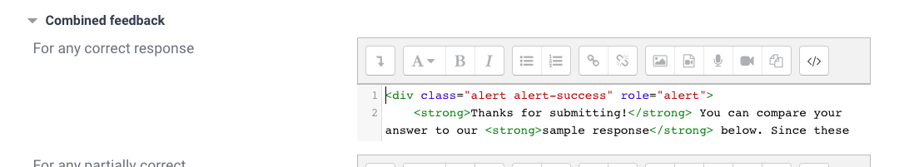

# Creator Call

short screencast videos
- what needs to be done?

* call about pedagogy
    - how to best teach content?

----

- Welcome:
    * who's who, what course
    * first batch of content creators

- Creator Docs
    * stay DRM-free, don't plagiarize

- Our Platform
    * copy a slice of an existing course to jumpstart

- Quizzes
    * **Adaptive Mode** for everything
    * CodeRunner
    * Open-ended text questions

- Early Feedback
    * share content while in development, let's chat about it

- Questions?
    - Jupyter Labs Server --> let's try it out

---

# Organization During Development
Explore whether it makes sense to use Trello boards on a per-course basis.

# General Course Settings
* set up auto-completion course-wide as follows:
    - _insert settings_

# Content
* stay DRM-free! We don't want to plagiarize.
    - Images: Only use images you made yourself or that are in the public domain. Creative Commons requires attribution, so post a link.
    - External Learning Resources: Link to great external resources you know of. Our main goal is for students to learn the topics. We want external resources to be clearly labeled and an _addition_ to our course content, not a replacement

# In-course quizzes
* quick and direct feedback - use "Adaptive Mode"
    - general quiz set-up guidelines
* sololearn style check-in quizzes

## Bootstrap Elements We Use
Avoid styling pages in the editor, it makes it individual and difficult to globally adapt and keep in sync.

Best way is to use Markdown with only little extra styling.

- headings (avoid bolding etc in editor)
- jumbotron resources
    * [Collapsible](https://platform.codingnomads.co/learn/mod/page/view.php?id=102) also cool for resources
    * create a PHP button to insert the HTML for such snippets?
- code blocks for different languages (plugins!)

# Thoughts
* “Workshop” resource for peer reviewed content

# Mobile
Mobile site available at https://platform.codingnomads.co/learn Tried it, works, and looks good! :)


--------------------------------------------------------------------------------


# Parking Space for Unused or Removed Documentation


## Open-Ended Text Questions

Open-ended questions should allow students to research concepts themselves, as well as guide them through sample responses, and finally also automatically mark a quiz as completed when a student gave their answer to all quiz questions.

To accomplish this in Moodle's question context, we use questions of the type **Essay (auto-graded)**.

The current setup:

* marks a student correct once they enter at least one character
* provides a sample answer when pressing the check button
* includes a reminder to compare and ask further questions to mentors/on the forum
* marks the quiz as completed when all questions have been answered

**Set the stage:** Use [this information-question](https://platform.codingnomads.co/learn/question/edit.php?courseid=8&cat=530%2C238&category=566%2C1&qbshowtext=0&recurse=0&showhidden=0) as the first question of each open-ended quiz you create. It will signify to students that they are entering exploration mode, as well as provide useful tips and a link to our forum.

<iframe width="560" height="315" src="https://www.youtube.com/embed/88s4uHrqUhE" frameborder="0" allow="accelerometer; autoplay; encrypted-media; gyroscope; picture-in-picture" allowfullscreen></iframe>

### How To Set Up Open-Ended Text Questions

<iframe width="560" height="315" src="https://www.youtube.com/embed/ZmOZgEJC29U" frameborder="0" allow="accelerometer; autoplay; encrypted-media; gyroscope; picture-in-picture" allowfullscreen></iframe>

In the Question Bank, create a new Category for the course section you are creating a quiz for. The suggested question type to use for questions that are designed to prompt students to think and formulate their own answers, is [**Essay (autograded)**](https://github.com/gbateson/moodle-qtype_essayautograde).

In **Combined Feedback** / "For any correct response" enter:

* the disclaimer alert box
* the sample answer



**Code for Disclaimer Alert Box:**

```html
<div class="alert alert-success" role="alert">
    <strong>Thanks for submitting!</strong> You can compare your answer to our
    <strong>sample response</strong> below. Since these are open-ended questions,
    the answers might not match completely. Please discuss any further questions
    with your mentor and on <a href="https://forum.codingnomads.co/" target="_blank" class="alert-link">our forum</a>.
</div>
```

In order to use the default auto-grading, specify a minimum number of characters to be used. This needs to be >0 (e.g. `1`). If this setting is left at `0`, then students will receive an "Incorrect" mark when submitting any written content. In **Auto-Grading** change to "Characters" and "1" in the respective boxes:


Finally, in the **Multiple tries** section, set the "Penalty for each incorrect try" to `0%`:


### Optional Settings

You can also change the input size of the answer text field:


You can also **add tags** to each question:


## Regex Short-Answer Questions

These work great for giving some more flexibility to students' answers.

<https://docs.moodle.org/37/en/Regular_Expression_Short-Answer_question_type>

You can:

* write Regex to specify a **limited set of answers**:

    >Q: Write one keyword that is part of a Python conditional
    >A: (if|elif|else)

* write Regex to **exclude** a wide set of wrong answers

    >Q:

**Note:** The plugin is designed to prevent using correct answers that have endless possibilities--therefore the use of Regex for correct answers is limited. This is purposefully designed like that. However, whole power of regex is available to you to identify _incorrect_ answers, while needing to be specific with correct answers.
