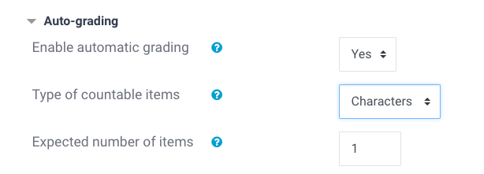

# Quiz Questions

## Open-Ended Text Questions

Open-ended questions should allow students to research concepts themselves, as well as guide them through sample responses,
and finally also automatically mark a quiz as completed when a student gave their answer to all quiz questions.

To accomplish this in Moodle's question context, we use questions of the type **Essay (auto-graded)**.

The current setup:

* marks a student correct once they enter at least one character
* provides a sample answer when pressing the check button
* includes a reminder to compare and ask further questions to mentors/on the forum
* marks the quiz as completed when all questions have been answered

### How To Set Up Open-Ended Text Questions

In the Question Bank, create a new Category for the course section you are creating a quiz for.

Next, create a new question of type **Essay (auto-graded)**.

You need to fill the following sections:

In **Combined Feedback** / "For any correct response" enter:

* the disclaimer alert box
* the sample answer


**Code for Disclaimer Alert Box:**

```html
<div class="alert alert-success" role="alert">
    <strong>Thanks for submitting!</strong> You can compare your answer to our
    <strong>sample response</strong> below. Since these are open-ended questions,
    the answers might not match completely. Please discuss any further questions
    with your mentor and on <a href="https://forum.codingnomads.co/" target="_blank" class="alert-link">our forum</a>.
</div>
```

In **Auto-Grading** change to "Characters" and "1" in the respective boxes:



Finally, in the **Multiple tries** section, set the "Penalty for each incorrect try" to `0%`:


### Optional Settings

You can also change the input size of the answer text field:


You can also **add tags** to each question:


